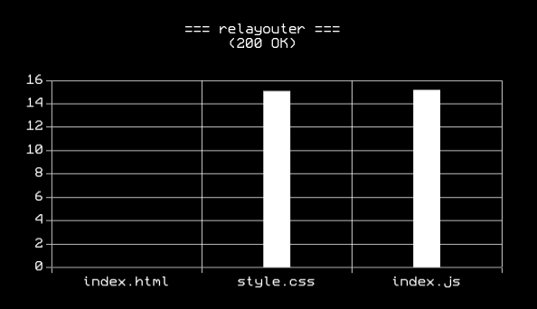

# relayouter

High-performance non-blocking static file serving web server implementation written in [FASM](https://flatassembler.net/), mostly inspired by [tiny-nginx](https://github.com/gd-arnold/tiny-nginx).



Naturally with this being x86 assembly using raw syscalls, it won't work on anything other than a Linux x86-64 machine.

## Overview

Relayouter is a very small (currently ~8 KiB) nginx-like http server that is:
- written in x86 assembly without libc (or any linking at all),
- parallelized across multiple processes bound to each CPU core,
- utilizing `epoll` for efficient I/O multiplexing,
- using only a single arena allocation for sharing data between processes (everything else is stack allocated),
- able to decode URLs and detect MIME types properly.

> [!NOTE]
> There are some critical bugs I need to fix with this. It's also very easily exploitable so don't use this in anything important.

## Usage

```sh
# clone the repo
git clone "https://github.com/peachey2k2/relayouter.git"
cd ./relayouter

make build # build
make run   # build and run
```

It'll be hosted on http://localhost:8080/ and serve from `./public`

### Todo
- [ ] recover from more errors
- [ ] switch to edge-triggered
- [ ] redo jumps with consideration for branch predictions
- [ ] reorganize the files
- [ ] configuration system
